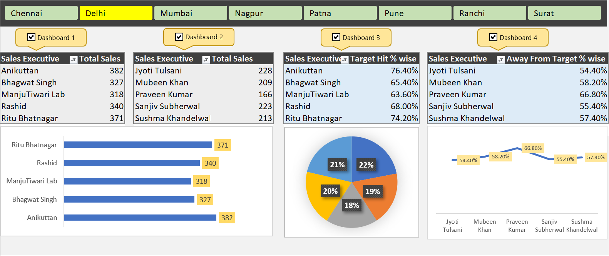
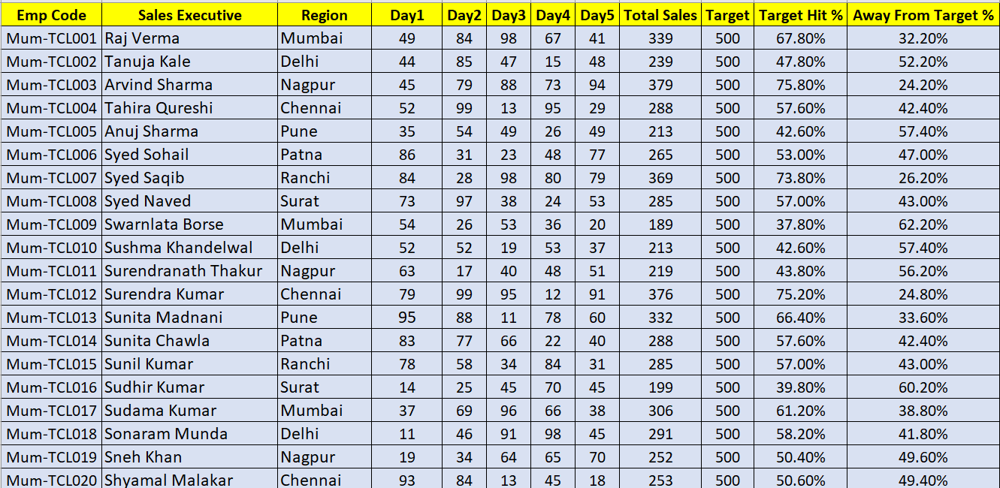

# 📊 Excel Sales Dashboard (End-to-End Project)

This is a fully functional Sales Dashboard built using Microsoft Excel. It covers everything from raw data to final visual reporting. The dashboard includes dynamic filters, pivot charts, and interactive elements with VBA for a seamless user experience.

---

## 📁 Project Structure

excel-sales-dashboard/
│
├── data/
│   └── Raw Data.xlsm
│
├── dashboard/
│   └── Complete Dashboard.xlsx
│
├── screenshots/
│   ├── Dashboard.png
│   └── Raw Data.png
│
└── README.md

---

## 🧠 Project Objective

The aim of this project is to demonstrate Excel-based data analysis and dashboard creation from scratch using real-world techniques. It highlights the ability to:
- Work with large datasets
- Use pivot tables for summary insights
- Create interactive dashboards with filters
- Incorporate macros/VBA for usability

---

## 🔧 Tools & Techniques Used

- **Microsoft Excel**
- **Pivot Tables** for data aggregation
- **Pivot Charts** for visualization
- **Slicers** for filtering by Region, Date, etc.
- **VBA/Macros** for slicer reset buttons and usability enhancements
- **Conditional Formatting** for clean visuals

---

## 🖼️ Dashboard Preview

## 🖼️ Dashboard Preview

| Dashboard | Raw Data |
|----------|----------|
|  |  |

---

## 🚀 How to Use

1. Navigate to the `dashboard/` folder
2. Download the Excel file
3. Enable Editing & Macros when prompted
4. Use slicers to explore different views of the data
5. Click reset buttons (if included) to reset filters

---

## 💼 Ideal For

- Data Analyst Portfolio
- Resume Projects
- Interview Demonstration
- Excel Practice Project

---

## ✍️ Author

**Shadab**  
Aspiring Data Analyst | Passionate about storytelling through data

---

